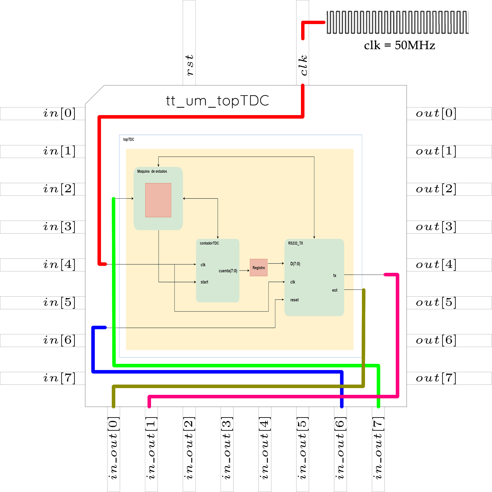
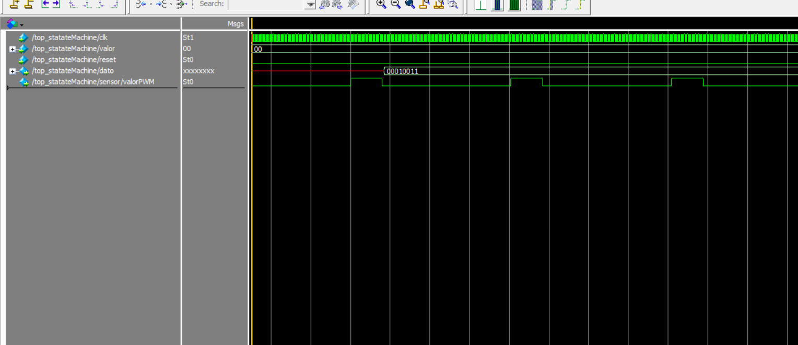
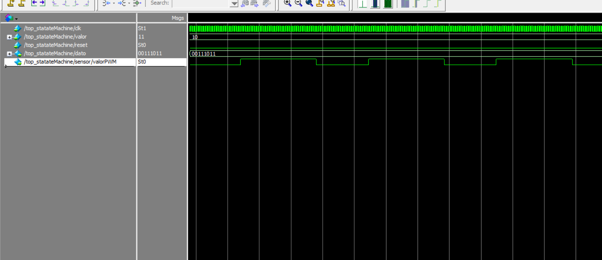
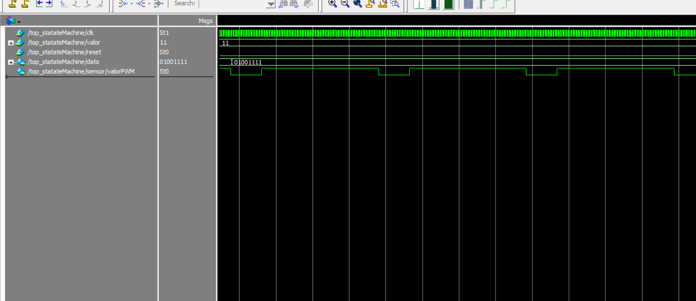

<!--
  

# Tiny Tapeout Verilog Project Template

- [Read the documentation for project](docs/info.md)

## What is Tiny Tapeout?

TinyTapeout is an educational project that aims to make it easier and cheaper than ever to get your digital designs manufactured on a real chip.

To learn more and get started, visit https://tinytapeout.com.

## Verilog Projects

1. Add your Verilog files to the `src` folder.
2. Edit the [info.yaml](info.yaml) and update information about your project, paying special attention to the `source_files` and `top_module` properties. If you are upgrading an existing Tiny Tapeout project, check out our [online info.yaml migration tool](https://tinytapeout.github.io/tt-yaml-upgrade-tool/).
3. Edit [docs/info.md](docs/info.md) and add a description of your project.
4. Optionally, add a testbench to the `test` folder. See [test/README.md](test/README.md) for more information.

The GitHub action will automatically build the ASIC files using [OpenLane](https://www.zerotoasiccourse.com/terminology/openlane/).

## Enable GitHub actions to build the results page

- [Enabling GitHub Pages](https://tinytapeout.com/faq/#my-github-action-is-failing-on-the-pages-part)

## Resources

- [FAQ](https://tinytapeout.com/faq/)
- [Digital design lessons](https://tinytapeout.com/digital_design/)
- [Learn how semiconductors work](https://tinytapeout.com/siliwiz/)
- [Join the community](https://tinytapeout.com/discord)
- [Build your design locally](https://docs.google.com/document/d/1aUUZ1jthRpg4QURIIyzlOaPWlmQzr-jBn3wZipVUPt4)

## What next?

- [Submit your design to the next shuttle](https://app.tinytapeout.com/).
- Edit [this README](README.md) and explain your design, how it works, and how to test it.
- Share your project on your social network of choice:
  - LinkedIn [#tinytapeout](https://www.linkedin.com/search/results/content/?keywords=%23tinytapeout) [@TinyTapeout](https://www.linkedin.com/company/100708654/)
  - Mastodon [#tinytapeout](https://chaos.social/tags/tinytapeout) [@matthewvenn](https://chaos.social/@matthewvenn)
  - X (formerly Twitter) [#tinytapeout](https://twitter.com/hashtag/tinytapeout) [@matthewvenn](https://twitter.com/matthewvenn)
-->

# How it works

El proyecto consiste en el diseño de un circuito Front end o interfaz para convertir a digital la señal proveniente de un sensor con salida en tiempo. La industria nos proporciona un sinfín de sensores para medir o monitorear diferentes variables físicas, dichos sensores pueden proporcionar su señal en diferentes formas, voltaje corriente, frecuencia, tiempo (ancho de pulso), entre otras. El bloque que se propone se enfoca en la conversión de tiempo (definido entre el pulso de start y stop) a un formato digital, también conocidos como circuitos TDC (Time to Digital Converter), para posteriormente enviarlo vía RS232 para que pueda ser monitoreado en una PC o dispositivo compatible con el protocolo RS232. 

En la figura 1 se muestra el diagrama a bloques del que se compone la aplicación, como se observa se compone de un bloque llamado **contadorTDC** el cual se encarga de realizar el conteo una vez que se recibe un pulso de entrada o señal de algun sensor, el dato generado se registra o almacena para posteriormente mediante el bloque **RS232_TX** enviarlo hacia la computadora.

Para que la aplicación funcione se crea una maquina de estados, la cual fungira como etapa de control teniendo el siguiente principio de funcionamiento cuando se active la señal o pulso se pasa a un estado que hace que se almacene el valor actual del contador, luego pasa a otro estado donde envia dicho dato al transmisor, luego pasa a otro estado que activa al transmisor para enviar el dato y luego a otro estado donde espera a que termine la transmisión y cuando ya termina la transmisión se regresa al estado inicial.

_**Figura 1.** Diagrama a bloques del TDC. Figura de elaboración propia._

>[!NOTE] 
>Pines propuestos (3 entradas, 2 salidas) con breve descripción:
>
> - **Pulso/señal -> input**.- En este elemento se conecta una señal que genera un ancho de pulso que oscila entre 40ns a 5.1us y con el cual inicia el conteo del tiempo que tarda dicho pulso para posteriormente generar un dato digital que se tranmitirá mediante RS232, esta señal será conectada en el pin **_in_out[7]_**.
>
> - **reset ->input**.- Elemento asíncrono que genera un reseto de la aplicación el cual se conectará en el pin **_in_out[6]_**.
>
> - **clk ->input**.- Este elemento contiene la señal de reloj, la cual será de 50MHz y que esta incluida dentro del diseño.
>
> - **tx -> output**.- Pin por el cual se envía el dato digital convertido, para ello se deberá conectar en el pin **_in_out[1]_** el RX de un modulo RS232 o computadora que recibirá el dato el cual deberá tener la siguiente configuración para el correcto funcionamiento:
>
>    - Baud: 9600
>    - Data size: 8 bits
>    - Paridad: impar
>
> - **eot ->output**.- Pin por el cual se muestra un indicador de fin de transmisión el cual se conectará en el pin **_in_out[0]_**.
>

---
Lo descrito anteriormente se representa en la figura 2 en la cual se observan los pines propuestos dentro del área de diseño.

_**Figura 2.** Diagrama a bloques del TDC dentro del área definda. Figura de elaboración propia._

# How to test

Las pruebas se realizaron en Modelsim en su versión gratuita, para ello se hizo una adecuación generando un pequeño modulo PWM dentro de la aplicación para simular lo que sería la señal de un sensor, para este caso se opto por generar cuatro valores de PWM los cuales generan cuatro valores distintos que se transmiten por RS232, en la figura 3 se muestra la primer combinación de PWM que corresponde a una combinación 00 y que genera un valor binario 00010011.

_**Figura 3.** Combinación 00 que genera un valor binario 00010011. Figura de elaboración propia._

El siguiente valor de prueba fue la combinación 01 la cual genero un valor binario 00100111 y dicha simulación se puede observar en la figura 4, en dicha figura se puede observar como cambia el ancho de pulso que hace que se genere dicho valor binario.

_**Figura 4.** Combinación 01 que genera un valor binario 00100111. Figura de elaboración propia._

A continuación el siguiente valor de prueba fue la combinación 10 la cual genero un valor binario 00111011 y dicha simulación se puede observar en la figura 5, en dicha figura se puede observar como cambia el ancho de pulso que hace que se genere dicho valor binario.

_**Figura 5.** Combinación 10 que genera un valor binario 00111011. Figura de elaboración propia._

Para finalizar la última combinación 11 genero un valor binario 01001111 y dicha simulación se puede observar en la figura 6, en dicha figura se puede observar al igual que las anteriores como cambia el ancho de pulso que hace que se genere dicho valor binario.

_**Figura 6.** Combinación 11 que genera un valor binario 01001111. Figura de elaboración propia._

Para finalizar la etapa de pruebas se opto por realizar una prueba en una tarjeta de desarrollo AMIBA 2, la cual cuenta con un FPGA Spartan 6 XC6SLX9, 216/576 Kb de Block RAM, un oscilador de 50 MHz, convertidor USB/RS232 (FTDI FT2232HL), leds de propósito general, switch de dos posiciones de propósito general, etc. En el siguiente [enlace](https://youtu.be/AC0O6wIpQp8) se podrá observar un video en el cual se muestran las distintas combinaciones simuladas anteriormente y además se puede ver el valor enviado por el puerto serial, el cual es monitoreado mediante la aplicación Serial Debug Assistant, como recurso extra se hizo uso de los leds de propósito general como apoyo para poder visualizar el valor generado y a su vez poder ver este valor en el monitor serial, que en nuestro caso se muestra en hexadecimal corroborando lo generado con lo enviado.

