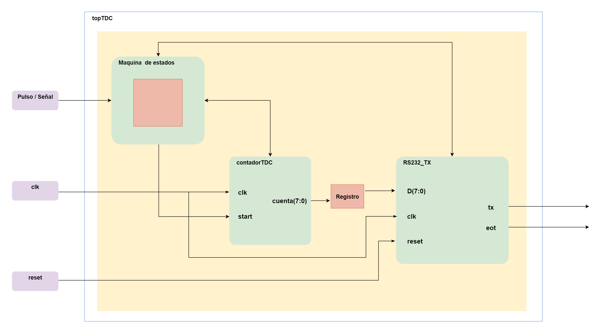

<!---

This file is used to generate your project datasheet. Please fill in the information below and delete any unused
sections.

You can also include images in this folder and reference them in the markdown. Each image must be less than
512 kb in size, and the combined size of all images must be less than 1 MB.
-->

## How it works

El proyecto consiste en el diseño de un circuito Front end o interfaz para convertir a digital la señal proveniente de un sensor con salida en tiempo. La industria nos proporciona un sinfín de sensores para medir o monitorear diferentes variables físicas, dichos sensores pueden proporcionar su señal en diferentes formas, voltaje corriente, frecuencia, tiempo (ancho de pulso), entre otras. El bloque que se propone se enfoca en la conversión de tiempo (definido entre el pulso de start y stop) a un formato digital, también conocidos como circuitos TDC (Time to Digital Converter), para posteriormente enviarlo vía RS232 para que pueda ser monitoreado en una PC o dispositivo compatible con el protocolo RS232. 

En la figura 1 se muestra el diagrama a bloques del que se compone la aplicación, como se observa se compone de un bloque llamado **contadorTDC** el cual se encarga de realizar el conteo una vez que se recibe un pulso de entrada o señal de algun sensor, el dato generado se registra o almacena para posteriormente mediante el bloque **RS232_TX** enviarlo hacia la computadora.

Para que la aplicación funcione se crea una maquina de estados, la cual fungira como etapa de control teniendo el siguiente principio de funcionamiento cuando se active el la señal o pulso se pasa a un estado que hace que se almacene el valor actual del contador, luego pasa a otro estado donde envia dicho dato al transmisor, luego pasa a otro estado que activa al transmisor para enviar el dato y luego a otro estado donde espera a que termine la transmisión y cuando ya termina la transmisión se regresa al estado inicial.

**Figura 1.** Diagrama a bloques del TDC.

Pines propuestos (3 entradas, 2 salidas):

Pulso/señal -> input

reset ->input

clk ->input

tx -> output

eot ->output

<!---
## How to test

TDC

## External hardware

TDC
-->
