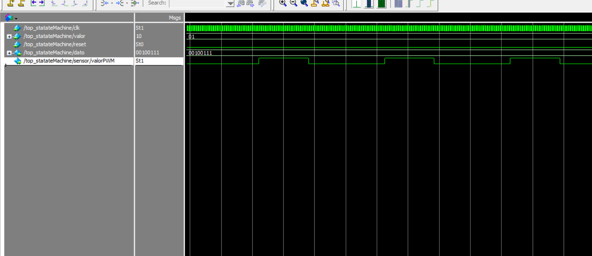
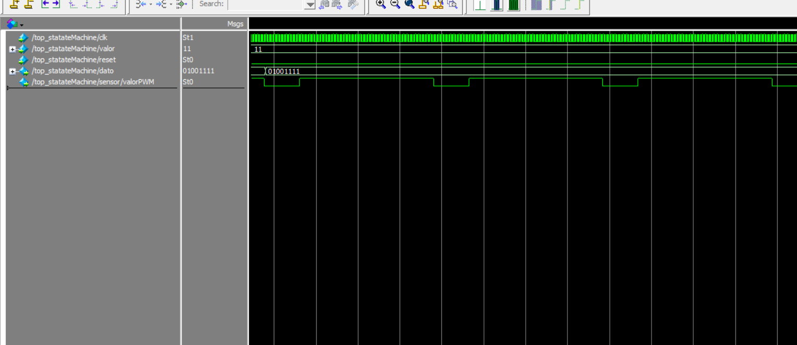

<!---

This file is used to generate your project datasheet. Please fill in the information below and delete any unused
sections.

You can also include images in this folder and reference them in the markdown. Each image must be less than
512 kb in size, and the combined size of all images must be less than 1 MB.
-->

## How it works

El proyecto consiste en el diseño de un circuito Front end o interfaz para convertir a digital la señal proveniente de un sensor con salida en tiempo. La industria nos proporciona un sinfín de sensores para medir o monitorear diferentes variables físicas, dichos sensores pueden proporcionar su señal en diferentes formas, voltaje corriente, frecuencia, tiempo (ancho de pulso), entre otras. El bloque que se propone se enfoca en la conversión de tiempo (definido entre el pulso de start y stop) a un formato digital, también conocidos como circuitos TDC (Time to Digital Converter), para posteriormente enviarlo vía RS232 para que pueda ser monitoreado en una PC o dispositivo compatible con el protocolo RS232. 

En la figura 1 se muestra el diagrama a bloques del que se compone la aplicación, como se observa se compone de un bloque llamado **contadorTDC** el cual se encarga de realizar el conteo una vez que se recibe un pulso de entrada o señal de algun sensor, el dato generado se registra o almacena para posteriormente mediante el bloque **RS232_TX** enviarlo hacia la computadora.

Para que la aplicación funcione se crea una maquina de estados, la cual fungira como etapa de control teniendo el siguiente principio de funcionamiento cuando se active la señal o pulso se pasa a un estado que hace que se almacene el valor actual del contador, luego pasa a otro estado donde envia dicho dato al transmisor, luego pasa a otro estado que activa al transmisor para enviar el dato y luego a otro estado donde espera a que termine la transmisión y cuando ya termina la transmisión se regresa al estado inicial.

**Figura 1.** Diagrama a bloques del TDC. Figura de elaboración propia.

Pines propuestos (3 entradas, 2 salidas) con breve descripción:

**Pulso/señal -> input**.- En este pin se conecta la señal que genera el pulso con el cual inicia el conteo del tiempo que tarda el dicho pulso para generar un dato digital que se tranmitirá mediante RS232.

**reset ->input**.- Elemento asíncrono que genera un reseto de la aplicación.

**clk ->input**.- Este elemento contiene la señal de reloj, la cual será de 50MHz.

**tx -> output**.- Pin por el cual se envía el dato digital convertido. 

**eot ->output**.- Pin por el cual se muestra un indicar de fin de transmisión.

## How to test

Las pruebas se realizaron en Modelsim en su versión gratuita, para ello se hizo una adecuación generando un pequeño modulo PWM dentro de la aplicación para simular lo que sería la señal de un sensor, para este caso se opto por generar cuatro valores de PWM los cuales generan cuatro valores distintos que se transmiten por RS232, en la figura 2 se muestra la primer combinación de PWM que corresponde a una combinación 00 y que genera un valor binario 00010011.

**Figura 2.** Combinación 00 que genera un valor binario 00010011. Figura de elaboración propia.

El siguiente valor de prueba fue la combinación 01 la cual genero un valor binario 00100111 y dicha simulación se puede observar en la figura 3, en dicha figura se puede observar como cambia el ancho de pulso que hace que se genere dicho valor binario.

**Figura 3.** Combinación 01 que genera un valor binario 00100111. Figura de elaboración propia.

A continuación el siguiente valor de prueba fue la combinación 10 la cual genero un valor binario 00111011 y dicha simulación se puede observar en la figura 4, en dicha figura se puede observar como cambia el ancho de pulso que hace que se genere dicho valor binario.

**Figura 4.** Combinación 10 que genera un valor binario 00111011. Figura de elaboración propia.

Para finalizar la última combinación 11 genero un valor binario 01001111 y dicha simulación se puede observar en la figura 5, en dicha figura se puede observar al igual que las anteriores como cambia el ancho de pulso que hace que se genere dicho valor binario.

**Figura 5.** Combinación 11 que genera un valor binario 01001111. Figura de elaboración propia.

Para finalizar la etapa de pruebas se opto por realizar una prueba en una tarjeta de desarrollo AMIBA 2, la cual cuenta con un FPGA Spartan 6 XC6SLX9, 216/576 Kb de Block RAM, un oscilador de 50 MHz, convertidor USB/RS232 (FTDI FT2232HL), leds de propósito general, switch de dos posiciones de propósito general, etc. En el siguiente [enlace](https://youtu.be/AC0O6wIpQp8) se podrá observar un video en el cual se muestran las distintas combinaciones simuladas anteriormente y además se puede ver el valor enviado por el puerto serial, el cual es monitoreado mediante la aplicación Serial Debug Assistant, como recurso extra se hizo uso de los leds de propósito general como apoyo para poder visualizar el valor generado y a su vez poder ver este valor en el monitor serial, que en nuestro caso se muestra en hexadecimal corroborando lo generado con lo enviado.

<!---
## External hardware

TDC
-->
